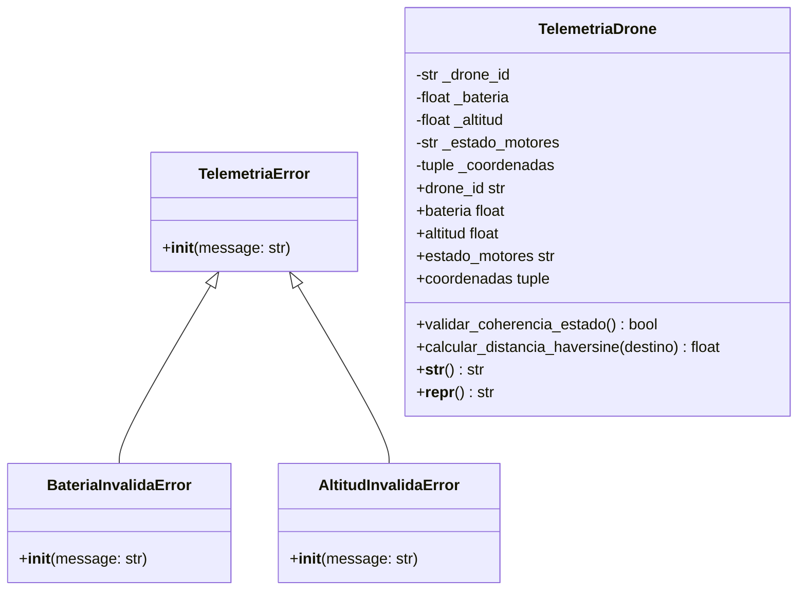

# 📐 Documento 03: Modelo del Mundo y Diagrama UML

**Proyecto:** Sistema de Validación de Telemetría y Gestión de Drones (POO)  
**Institución:** Universidad de Medellín  

---

## Modelo del Mundo
El **Modelo del Mundo** describe las clases principales identificadas para abstraer la solución del problema de telemetría y gestión de drones:

### 1. Clase `TelemetriaDrone`
* **Atributos privados:**
  * `_drone_id`: `str`
  * `_bateria`: `float`
  * `_altitud`: `float`
  * `_estado_motores`: `str`
  * `_coordenadas`: `tuple[float, float]`
* **Métodos principales:**
  * Getters y Setters con validaciones dinámicas (`@property`).
  * `validar_coherencia_estado() -> bool`
  * `calcular_distancia_haversine(destino: tuple[float, float]) -> float`
  * `__str__()` y `__repr__()`

### 2. Excepciones de Dominio
* `TelemetriaError(ValueError)`: Excepción base.
* `BateriaInvalidaError(TelemetriaError)`: Lanzada ante porcentaje inválido.
* `AltitudInvalidaError(TelemetriaError)`: Lanzada ante altitud fuera de rango regulatorio.

---

## Diagrama de Clases UML

