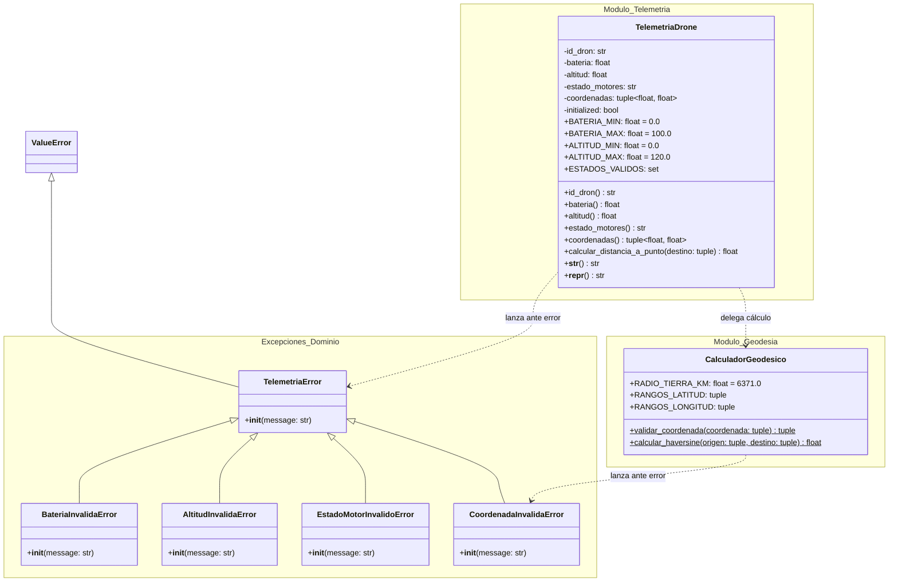

# Documento 03: Modelo del Mundo, Responsabilidades y Diagrama UML

**Proyecto:** SkyRoute - Sistema de Gestión y Telemetría para Drones  
**Asignatura:** Algoritmos de Programación Orientada a Objetos  
**Institución:** Universidad de Medellín (UDEM)  

---

## 1. Comprensión del Mundo del Problema

El modelo del dominio abstrae los elementos esenciales para la operación y validación de las tramas de vuelo:

### 1.1 Entidades y Características (Atributos)

1. **`TelemetriaDrone` (Entidad de Dominio Principal):**
   - `id_dron` (`str`): Identificador único de la aeronave.
   - `bateria` (`float`): Nivel porcentual de carga $[0.0, 100.0]\%$.
   - `altitud` (`float`): Elevación en metros $[0.0, 120.0]\,m$.
   - `estado_motores` (`str`): Estado operacional (`'APAGADOS'`, `'STANDBY'`, `'EN_VUELO'`, `'EMERGENCIA'`).
   - `coordenadas` (`tuple[float, float]`): Par geográfico $(\text{latitud}, \text{longitud})$.

2. **`CalculadorGeodesico` (Componente de Utilidad y Cálculo):**
   - `RADIO_TIERRA_KM` (`float = 6371.0`): Constante del radio terrestre.
   - `RANGOS_LATITUD` (`tuple = (-90.0, 90.0)`): Límites de latitud.
   - `RANGOS_LONGITUD` (`tuple = (-180.0, 180.0)`): Límites de longitud.

3. **Jerarquía de Excepciones de Dominio:**
   - `TelemetriaError` $\rightarrow$ Hereda de `ValueError`.
     - `BateriaInvalidaError`
     - `AltitudInvalidaError`
     - `EstadoMotorInvalidoError`
     - `CoordenadaInvalidaError`

---

## 2. Asignación de Responsabilidades

| Entidad / Clase | Responsabilidades | Colaboradores | Información que Administra |
|---|---|---|---|
| **`TelemetriaDrone`** | 1. Encapsular el estado instantáneo del dron. 2. Validar cada atributo mediante `@property` y setters. 3. Blindar la coherencia de estado física (Altitud vs Motores) en instanciación y mutaciones. 4. Delegar cálculos geodésicos a `CalculadorGeodesico`. 5. Proveer representaciones formateadas (`__str__`, `__repr__`). | `CalculadorGeodesico` `TelemetriaError` (y subclases) | `_id_dron`: str `_bateria`: float `_altitud`: float `_estado_motores`: str `_coordenadas`: tuple[float, float] |
| **`CalculadorGeodesico`** | 1. Validar formato y rangos geográficos de tuplas de coordenadas. 2. Implementar la fórmula de Haversine para cálculo de distancia ortodrómica. | `CoordenadaInvalidaError` | `RADIO_TIERRA_KM`: float `RANGOS_LATITUD`: tuple `RANGOS_LONGITUD`: tuple |
| **Excepciones de Dominio** | 1. Interrumpir de forma controlada la ejecución ante violaciones de regla. 2. Generar mensajes claros con el valor y tipo de error detectado. | `ValueError` | `message`: str |

---

## 3. Matriz de Trazabilidad (Requisitos vs Software)

| Requisito Funcional | Entidad Responsable | Método / Mecanismo de Implementación |
|---|---|---|
| **RF-01** (Validar e Instanciar) | `TelemetriaDrone` | Setters decorados (`@property`), validaciones atómicas y `__init__` |
| **RF-02** (Excepciones de Dominio) | `TelemetriaError` y subclases | Instrucciones `raise` en los setters de validación |
| **RF-03** (Calcular Distancia) | `TelemetriaDrone` / `CalculadorGeodesico` | `TelemetriaDrone.calcular_distancia_a_punto()` $\rightarrow$ `CalculadorGeodesico.calcular_haversine()` |
| **RF-04** (Inspección en Consola) | `TelemetriaDrone` | Métodos dunder `__str__()` y `__repr__()` |

---

## 4. Diagrama de Clases UML (Mermaid)

