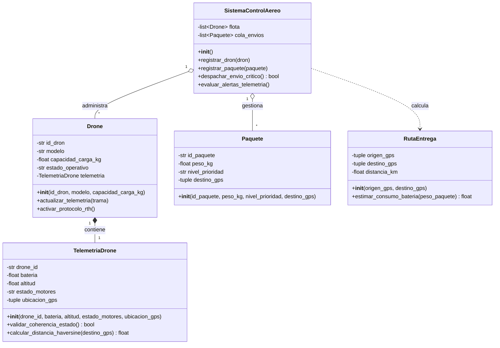

# 📐 Documento 03: Modelo del Mundo y Diagrama de Clases UML

**Proyecto:** SkyRoute Drones - Sistema Integrado de Telemetría, Logística y Tráfico Aéreo UAS  
**Asignatura:** Algoritmos de Programación Orientada a Objetos (UDEM)  

---

## 1. Descripción del Modelo del Mundo
El **Modelo del Mundo** representa la abstracción de las entidades del dominio real que interactúan en la solución. 

Las clases principales identificadas son:
1. **`TelemetriaDrone`**: Modela los datos de sensores y estado en tiempo real emitidos por el dron (batería, altitud, coordenadas, motores).
2. **`Drone`**: Entidad física del vehículo aéreo que posee un ID, modelo, capacidad de carga, nivel de batería y contiene un objeto de `TelemetriaDrone`.
3. **`Paquete`**: Entidad que representa la mercancía a entregar (peso, tipo, nivel de prioridad, coordenadas de destino).
4. **`RutaEntrega`**: Plan de vuelo que calcula la distancia ortodrómica (Haversine) entre la base de origen y el destino del paquete.
5. **`SistemaControlAereo`**: Clase administradora (Controlador principal) que gestiona la lista de drones (`list[Drone]`), la cola de paquetes (`list[Paquete]`), efectúa las validaciones globales y ejecuta protocolos de emergencia RTH.

---

## 2. Diagrama de Clases UML (Sintaxis Mermaid)

---

## 3. Descomposición de Responsabilidades (POO)

* **Encapsulamiento:** Todos los atributos de estado crítico (`bateria`, `altitud`, `estado_motores`) serán privados (prefijo `_`) en `TelemetriaDrone` y expuestos mediante `@property` con validadores específicos.
* **Composición:** Un objeto `Drone` *posee* una instancia de `TelemetriaDrone`. Si el dron deja de existir en memoria, su telemetría asociada se destruye con él.
* **Agregación:** `SistemaControlAereo` mantiene colecciones de `Drone` y `Paquete`. Los drones y paquetes existen independientemente del sistema de control.
