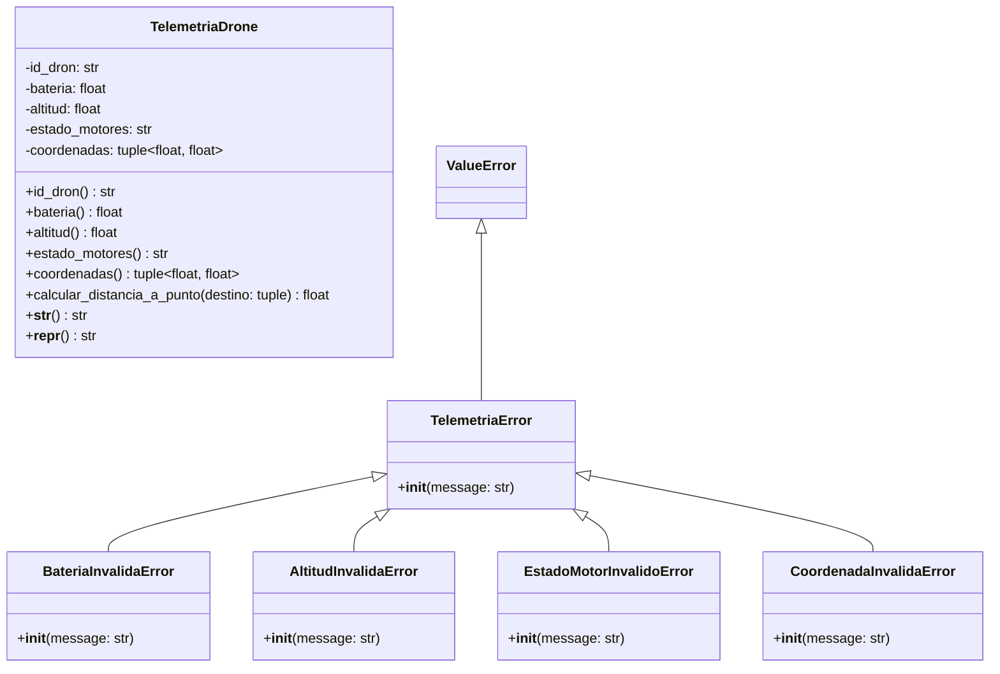

# Documento 03: Modelo del Mundo, Responsabilidades y Diagrama UML

**Proyecto:** SkyRoute - Sistema de Gestión y Telemetría para Drones  
**Asignatura:** Algoritmos de Programación Orientada a Objetos  
**Institución:** Universidad de Medellín (UDEM)  

---

## 1. Comprensión del Mundo del Problema

El modelo del mundo recopila los elementos identificados para la capa inicial de telemetría y validación del sistema (`src/telemetria_drone.py`):

### Entidades y Sus Características (Atributos)
1. **`TelemetriaDrone`**: Representa la entidad concreta del dron operando.
   - `id_dron` (`str`): Identificador único alfanumérico.
   - `bateria` (`float`): Nivel de batería $[0.0, 100.0]\%$.
   - `altitud` (`float`): Altura sobre el suelo $[0.0, 120.0]\,m$.
   - `estado_motores` (`str`): Estado del sistema de propulsión (`'APAGADOS'`, `'STANDBY'`, `'EN_VUELO'`, `'EMERGENCIA'`).
   - `coordenadas` (`tuple[float, float]`): Posición geográfica $(\text{latitud}, \text{longitud})$.

2. **Jerarquía de Excepciones de Dominio**:
   - `TelemetriaError`: Excepción genérica de telemetría (hereda de `ValueError`).
   - `BateriaInvalidaError`, `AltitudInvalidaError`, `EstadoMotorInvalidoError`, `CoordenadaInvalidaError`: Excepciones específicas de validación.

---

## 2. Asignación de Responsabilidades

### **Clase: `TelemetriaDrone`**
* **Responsabilidades:**
  1. Representar el estado instantáneo de la telemetría del dron.
  2. Garantizar la validez de sus atributos mediante encapsulamiento estricto.
  3. Validar la coherencia aeronáutica entre altitud y motores.
  4. Calcular la distancia ortodrómica a un destino geográfico (Fórmula de Haversine).
  5. Proporcionar representaciones de texto legibles (`__str__` y `__repr__`).
* **Colaboradores:** Ninguno por el momento (Entidad atómica preliminar).
* **Información que Administra:** `_id_dron`, `_bateria`, `_altitud`, `_estado_motores`, `_coordenadas`.

### **Clases: Excepciones de Dominio**
* **Responsabilidades:** Interrumpir la ejecución y notificar errores específicos de negocio con mensajes claros.
* **Colaboradores:** `ValueError` (Librería estándar).
* **Información que Administra:** `message` (cadena descriptiva de la falla).

---

## 3. Relación entre Responsabilidades y Requisitos Funcionales

| Requerimiento Funcional | Entidades Responsables | Mecanismo de Implementación |
|---|---|---|
| **R1. Validar e Instanciar Trama** | `TelemetriaDrone` | Setters decorados (`@property`) y `__init__` |
| **R2. Notificar Excepciones** | Excepciones de Dominio | `raise` en los setters ante violaciones de regla |
| **R3. Calcular Distancia** | `TelemetriaDrone` | Método `calcular_distancia_a_punto(destino)` |
| **R4. Consultar Formato** | `TelemetriaDrone` | Métodos dunder `__str__()` y `__repr__()` |

---

## 4. Diagrama de Clases UML (Modelo Conceptual)

