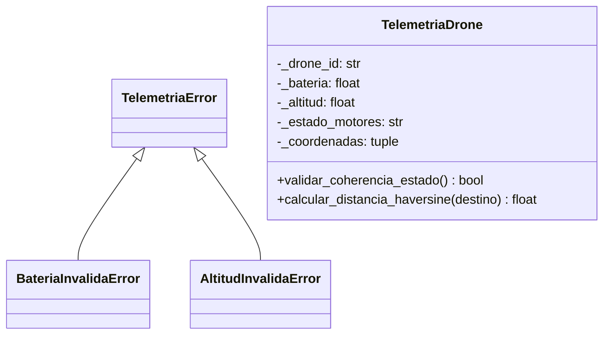

# Documento 03: Modelo del Mundo y Diagrama UML

**Proyecto:** Sistema de Gestión y Telemetría para Drones  
**Asignatura:** Algoritmos de Programación Orientada a Objetos  
**Institución:** Universidad de Medellín  

---

## Modelo del Mundo

El **Modelo del Mundo** representa las entidades abstraídas a partir del problema propuesto en el ejercicio base `ejercicio_1_poo.py`:

### Entidades y Jerarquía de Clases

1. **`TelemetriaDrone`**: Clase encargada de encapsular el estado de vuelo y lecturas de sensores de un dispositivo.
   - **Atributos:** Identificador del dron, nivel de batería, altitud actual, estado de motores y coordenadas de posición.
   - **Comportamiento:** Control de acceso mediante encapsulamiento, verificación de coherencia de estado y cálculo de distancia relativa (Haversine).

2. **Excepciones de Dominio**:
   - `TelemetriaError`: Excepción general para inconsistencias de telemetría.
   - `BateriaInvalidaError`: Excepción especializada para lecturas fuera de porcentaje permitido.
   - `AltitudInvalidaError`: Excepción especializada para lecturas fuera de límites normativos.

---

## Diagrama de Clases UML (Modelo Preliminar)

