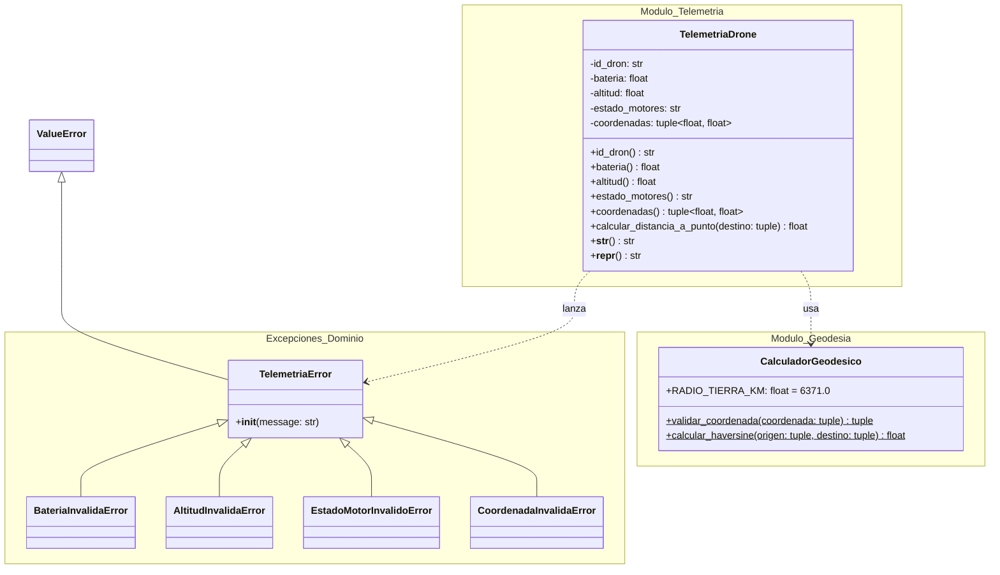

# Documentación Oficial de Análisis del Problema - Entregable 1

**Proyecto:** SkyRoute - Sistema de Gestión y Telemetría para Drones  
**Asignatura:** Algoritmos de Programación Orientada a Objetos  
**Institución:** Universidad de Medellín (UDEM)  
**Semestre:** 2026-2  
**Docente:** Mario Alejandro Saldarriaga (Grupo 62)  
**Equipo de Trabajo:** Alejandro García Jiménez, Juan Manuel Pava Higuita, Valery Arboleda Ardila  

---

## 📋 1. Planteamiento e Historial del Proyecto

### 1.1 Contexto del Problema
Una empresa dedicada al transporte y logística mediante aeronaves no tripuladas (drones) para entregas de última milla requiere un módulo de software de alta confiabilidad capaz de recibir, procesar y validar tramas de telemetría emitidas en tiempo real por los sensores a bordo.

En operaciones aeronáuticas civiles y logísticas, la integridad de los datos reportados es crítica para la seguridad del espacio aéreo. El módulo **SkyRoute Telemetry Core** opera como la primera línea de defensa antes de transmitir la información al centro de control de tráfico aéreo. Su misión es detectar y rechazar inmediatamente tramas corruptas, fuera de norma legal o físicamente contradictorias.

### 1.2 Historial y Evolución Incremental
- **Módulo de Dominio Inicial:** Implementación de la entidad de telemetría (`src/telemetria.py`), jerarquía de excepciones (`src/exceptions.py`) y cálculo geodésico de Haversine (`src/utils/geodesia.py`).
- **Blindaje de Invariantes y Tipos:**
  - Validación cruzada bidireccional entre altitud y motores.
  - Exclusión estricta de booleanos en validación de números reales.
- **Fase de Análisis y Pruebas (Entregable 1):** Formalización de Requisitos Funcionales, Reglas de Negocio, Modelo del Mundo UML y suite de 20 pruebas automatizadas con `unittest`.

---

## 🎯 2. Requisitos Funcionales (RF)

| ID | Nombre | Resumen / Actor | Entradas | Resultado Esperado |
|---|---|---|---|---|
| **RF-01** | Validar e Instanciar Trama de Telemetría | **Actor:** Sensor / Operador. Recibe los datos de telemetría de un dron, aplica validaciones de tipo, rango y coherencia cruzada, e instanciación del objeto. | `id_dron` (str), `bateria` (float), `altitud` (float), `estado_motores` (str), `coordenadas` (tuple[float, float]) | Objeto `TelemetriaDrone` registrado exitosamente. Si alguna regla de negocio falla, se interrumpe la instanciación. |
| **RF-02** | Notificar Excepciones de Dominio | **Actor:** Sistema / Operador. Identifica lecturas inconsistentes o fuera de norma y genera excepciones específicas con mensajes descriptivos. | Trama de telemetría o valores inválidos pasados por parámetro | Interrupción controlada y lanzamiento de `BateriaInvalidaError`, `AltitudInvalidaError`, `EstadoMotorInvalidoError` o `CoordenadaInvalidaError`. |
| **RF-03** | Calcular Distancia Ortodrómica a Destino | **Actor:** Operador de Vuelo. Calcula la distancia geodésica en kilómetros desde la posición actual del dron hacia un punto de destino utilizando la fórmula de Haversine. | `destino` (tuple[float, float]) | Número flotante (`float`) representando la distancia estimada en kilómetros ($km$). |
| **RF-04** | Consultar Formato de Consola e Inspección Técnica | **Actor:** Operador / Desarrollador. Genera una representación legible del estado del dron para monitoreo (`__str__`) o depuración técnica (`__repr__`). | Instancia de `TelemetriaDrone` | Cadena de texto formateada con la información consolidada. |

---

## 📜 3. Reglas de Negocio del Sistema (Restricciones de Dominio)

1. **Identificador Único (`id_dron`):** Cadena alfanumérica no vacía (`str`).
2. **Nivel de Batería (`bateria`):** Rango strictly delimitado en $[0.0, 100.0]\%$.
3. **Límite de Altitud (`altitud`):** Medida en metros, restringida por regulación aeronáutica al rango $[0.0, 120.0]\,m$.
4. **Coherencia Estado de Motores vs Altitud:**
   - Si $\text{altitud} > 0.0\,m$, el estado de los motores debe ser obligatoriamente `'EN_VUELO'`.
   - Si $\text{altitud} == 0.0\,m$, el estado de los motores **no** puede ser `'EN_VUELO'` (debe ser `'APAGADOS'`, `'STANDBY'` o `'EMERGENCIA'`).
   - El conjunto de estados válidos es estrictamente: `{'APAGADOS', 'STANDBY', 'EN_VUELO', 'EMERGENCIA'}`.
   - La coherencia se valida bidireccionalmente ante cualquier mutación.
5. **Coordenadas Geográficas (`coordenadas`):** Tupla de dos flotantes $(\text{latitud}, \text{longitud})$ con $\text{latitud} \in [-90.0, 90.0]$ y $\text{longitud} \in [-180.0, 180.0]$.

---

## 🌍 4. Comprensión del Mundo del Problema y Responsabilidades

| Entidad / Clase | Responsabilidades | Colaboradores | Información que Administra |
|---|---|---|---|
| **`TelemetriaDrone`** | 1. Encapsular la información de telemetría del dron. 2. Validar cada atributo durante la instanciación y modificación. 3. Evaluar la coherencia de estado entre altitud y motores. 4. Delegar el cálculo ortodrómico a `CalculadorGeodesico`. 5. Proveer representaciones textuales para consola y depuración. | `CalculadorGeodesico` `TelemetriaError` (y subclases) | `_id_dron`: str `_bateria`: float `_altitud`: float `_estado_motores`: str `_coordenadas`: tuple[float, float] |
| **`CalculadorGeodesico`** | 1. Validar formato y límites geográficos. 2. Ejecutar la fórmula de Haversine ($R = 6371.0\,km$). | `CoordenadaInvalidaError` | Constantes de radio terrestre y límites de coordenadas |
| **`TelemetriaError` (y Subclases)** | 1. Interrumpir la ejecución de manera controlada. 2. Proporcionar mensajes claros especificando el valor y la regla infringida. | `ValueError` (Python standard) | `message`: str |

---

## 🔗 5. Matriz de Trazabilidad

| Requisito Funcional | Entidad Responsable | Método / Mecanismo Asociado |
|---|---|---|
| **RF-01** (Validar e Instanciar) | `TelemetriaDrone` | Setters decorados con `@property` y `__init__` |
| **RF-02** (Excepciones de Dominio) | `TelemetriaError` y Subclases | Bloques `raise` en los setters de validación |
| **RF-03** (Calcular Distancia) | `TelemetriaDrone` / `CalculadorGeodesico` | `calcular_distancia_a_punto(destino)` $\rightarrow$ `CalculadorGeodesico.calcular_haversine()` |
| **RF-04** (Salida Consola/Inspección) | `TelemetriaDrone` | `__str__()` y `__repr__()` |

---

## 📐 6. Diagrama de Clases UML (Modelo del Mundo)

