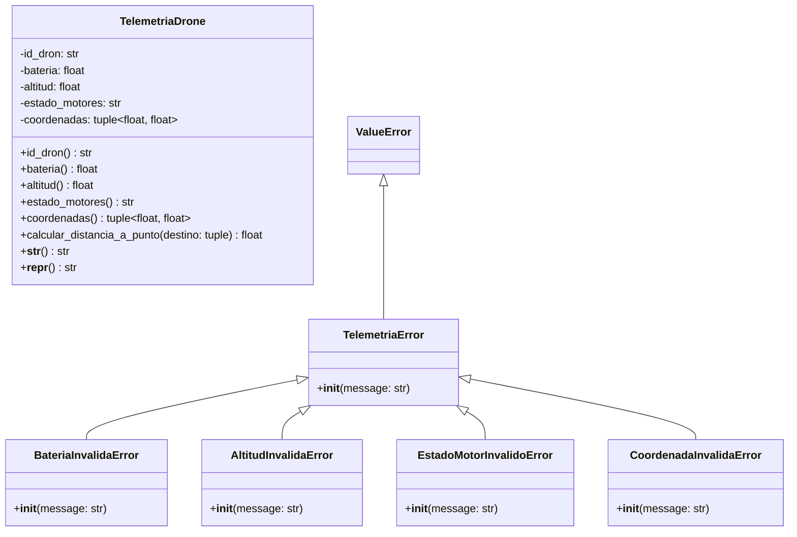

# Documentación Oficial de Análisis del Problema - Entregable 1

**Proyecto:** SkyRoute - Sistema de Gestión y Telemetría de Drones  
**Asignatura:** Algoritmos de Programación Orientada a Objetos  
**Institución:** Universidad de Medellín (UDEM)  
**Semestre:** 2026-2  
**Docente:** Mario Alejandro Saldarriaga  
**Equipo de Trabajo:** Alejandro García Jiménez, Juan Manuel Pava Higuita, Valery Arboleda Ardila  

---

## 📋 1. Planteamiento e Historial del Proyecto

### 1.1 Contexto del Problema
Una empresa dedicada al transporte y logística mediante aeronaves no tripuladas (drones) de última milla requiere un módulo de software capaz de recibir, procesar y validar tramas de telemetría en tiempo real. 

En operaciones aeronáuticas de drones, la integridad de los datos reportados por los sensores en tiempo real es crítica. El software actúa como la primera línea de defensa para identificar y rechazar tramas inconsistentes o fuera de normas operacionales (tales como niveles de batería erróneos, altitudes prohibidas o incoherencias entre la altitud del dron y el estado de sus motores) antes de transmitir la información al servidor de control aéreo.

### 1.2 Historial y Evolución Incremental
- **Módulo de Dominio Inicial:** El proyecto se construye sobre el módulo de telemetría y validación operacional (`src/telemetria_drone.py`), el cual establece las bases de encapsulamiento y coherencia aeronáutica.
- **Enfoque Actual (Fase de Análisis):** Organización y formalización de toda la metodología de Análisis de Problemas de POO, estableciendo la estructura requerida para los componentes actuales y sentando las bases para las ampliaciones del sistema.

---

## 🎯 2. Requisitos Funcionales (RF)

Siguiendo la metodología oficial de la UDEM, cada Requisito Funcional representa un servicio puntual que el programa ofrece al usuario/operador para resolver una parte del problema.

| ID | Nombre | Resumen / Actor | Entradas | Resultado Esperado |
|---|---|---|---|---|
| **RF-01** | Validar e Instanciar Trama de Telemetría | **Actor:** Operador / Sensor. Recibe los datos de telemetría de un dron, aplica las validaciones de tipo y rango de negocio, y registra la trama si es consistente. | `id_dron` (str), `bateria` (float), `altitud` (float), `estado_motores` (str), `coordenadas` (tuple[float, float]) | Trama de telemetría registrada exitosamente en el sistema. Si alguna regla de negocio falla, se interrumpe la instanciación y se lanza la excepción de dominio correspondiente. |
| **RF-02** | Notificar Excepciones de Dominio | **Actor:** Sistema / Operador. Identifica lecturas inconsistentes o fuera de norma y genera alertas/excepciones específicas con mensajes descriptivos. | Trama de telemetría o valores atípicos pasados por parámetro | Interrupción controlada de la operación y generación del mensaje de error específico (`BateriaInvalidaError`, `AltitudInvalidaError`, `EstadoMotorInvalidoError`, `CoordenadaInvalidaError`). |
| **RF-03** | Calcular Distancia Ortodrómica a Destino | **Actor:** Operador de Vuelo. Calcula la distancia geodésica en kilómetros desde la posición actual del dron hacia un punto de destino utilizando la fórmula de Haversine. | `destino` (tuple[float, float]) | Número flotante (`float`) representando la distancia estimada en kilómetros ($km$) a la coordenada indicada. |
| **RF-04** | Consultar Formato de Consola e Inspección Técnica | **Actor:** Operador / Desarrollador. Genera una representación formateada y legible del estado del dron para la consola de monitoreo (`__str__`) o depuración técnica (`__repr__`). | Instancia de `TelemetriaDrone` | Cadena de texto formateada con la información consolidada de batería, altitud y motores. |

---

## 📜 3. Reglas de Negocio del Sistema (Restricciones de Dominio)

1. **Identificador Único (`id_dron`):** Cadena alfanumérica no vacía.
2. **Nivel de Batería (`bateria`):** Rango strictly delimitado en $[0.0, 100.0]\%$.
3. **Límite de Altitud (`altitud`):** Medida en metros, restringida por regulación aeronáutica al rango $[0.0, 120.0]\,m$.
4. **Coherencia Estado de Motores vs Altitud:**
   - Si $\text{altitud} > 0.0\,m$, el estado de los motores debe ser obligatoriamente `'EN_VUELO'`.
   - Si $\text{altitud} == 0.0\,m$, el estado de los motores **no** puede ser `'EN_VUELO'` (debe ser `'APAGADOS'`, `'STANDBY'` o `'EMERGENCIA'`).
   - El conjunto de estados válidos es estrictamente: `{'APAGADOS', 'STANDBY', 'EN_VUELO', 'EMERGENCIA'}`.
5. **Coordenadas Geográficas (`coordenadas`):** Tupla de dos flotantes $(\text{latitud}, \text{longitud})$ con $\text{latitud} \in [-90.0, 90.0]$ y $\text{longitud} \in [-180.0, 180.0]$.

---

## 🌍 4. Comprensión del Mundo del Problema (Modelo de Dominio)

### 4.1 Entidades Identificadas y Características (Atributos)

#### **Entidad: `TelemetriaDrone`**
* **Descripción:** Representa la lectura instantánea y estado operativo de un vehículo aéreo no tripulado.
* **Atributos:**
  - `id_dron` (`str`): Identificador único alfanumérico.
  - `bateria` (`float`): Nivel de carga remanente en porcentaje.
  - `altitud` (`float`): Altura actual en metros sobre el nivel del suelo.
  - `estado_motores` (`str`): Estado operacional de la planta motriz.
  - `coordenadas` (`tuple[float, float]`): Par geográfico (latitud, longitud).

#### **Entidades de Dominio: Jerarquía de Excepciones**
* `TelemetriaError` (Hereda de `ValueError`): Excepción base del sistema.
  * `BateriaInvalidaError`: Fallo en rango de batería.
  * `AltitudInvalidaError`: Fallo en rango de altitud.
  * `EstadoMotorInvalidoError`: Incoherencia o estado no reconocido.
  * `CoordenadaInvalidaError`: Formato o rango geográfico erróneo.

---

## 🤝 5. Asignación de Responsabilidades

| Entidad / Clase | Responsabilidades | Colaboradores | Información que Administra |
|---|---|---|---|
| **`TelemetriaDrone`** | 1. Encapsular la información de telemetría del dron. 2. Validar cada atributo durante la instanciación y modificación. 3. Evaluar la coherencia de estado entre altitud y motores. 4. Calcular la distancia ortodrómica a un destino (Haversine). 5. Proveer representaciones textuales para consola y depuración. | Ninguno (Por ahora entidad atómica) | `_id_dron`: str `_bateria`: float `_altitud`: float `_estado_motores`: str `_coordenadas`: tuple[float, float] |
| **`TelemetriaError` (y Subclases)** | 1. Interrumpir la ejecución de manera controlada. 2. Proporcionar mensajes claros especificando el valor y la regla infringida. | `ValueError` (Python standard) | `message`: str |

---

## 🔗 6. Matriz de Trazabilidad (Requisitos vs Entidades)

| Requisito Funcional | Entidad / Clase Responsable | Método / Mecanismo Asociado |
|---|---|---|
| **RF-01** (Validar e Instanciar) | `TelemetriaDrone` | Setters decorados con `@property` y `__init__` |
| **RF-02** (Excepciones de Dominio) | `TelemetriaError` y Subclases | Bloques `raise` en los setters de `TelemetriaDrone` |
| **RF-03** (Calcular Distancia) | `TelemetriaDrone` | `calcular_distancia_a_punto(destino)` |
| **RF-04** (Salida Consola/Inspección) | `TelemetriaDrone` | `__str__()` y `__repr__()` |

---

## 📐 7. Diagrama de Clases UML (Modelo del Mundo)

